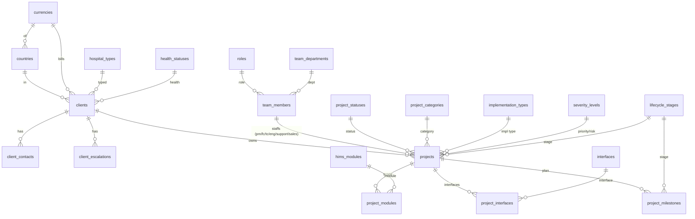
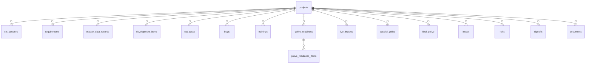
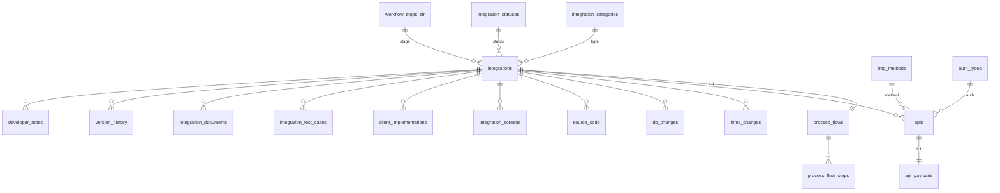
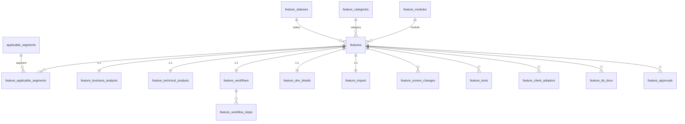

# Smart HIMS PMO — Database (MySQL 8)

Relational schema + seed built from the React app's static data in `src/data/*`.
Target engine: **MySQL 8** (InnoDB, `utf8mb4`).

| File | Purpose |
|---|---|
| `schema.sql` | `CREATE TABLE` statements, parents first, runnable top-to-bottom |
| `seed.sql` | `INSERT`s with the real static data, transaction-wrapped, FK-ordered (generated from `src/data/*` — deterministic, no invented values) |
| `rollback.sql` | `DROP TABLE` in reverse dependency order (FK checks off, idempotent) |

**~75 tables:** ~33 lookups + ~42 entity / junction / child tables. Seed loads **~1,300 rows** (incl. 228 project milestones, 120 sign-offs, 100 go-live checklist items, 80 master-data records, 70 SRS sessions, 68 documents, 55 bugs/trainings, 53 dev items, 47 UAT, 44 requirements, 42 issues, 24 risks, 20 features, 14 integrations/APIs, …).

## How to run

```bash
# create the database
mysql -u root -p -e "CREATE DATABASE hims_pmo CHARACTER SET utf8mb4 COLLATE utf8mb4_0900_ai_ci;"

# schema, then seed
mysql -u root -p hims_pmo < schema.sql
mysql -u root -p hims_pmo < seed.sql

# tear down
mysql -u root -p hims_pmo < rollback.sql
```

The seed is wrapped in `START TRANSACTION … COMMIT`, so a mid-load failure rolls back cleanly.

## Design decisions

- **Natural string PKs preserved** from the source (`CL-001`, `PRJ-2025-014`, `U-01`, `API-1001`, `FEA-1001`, `INT-01`, `SRS-001`, …) to keep foreign-key fidelity and make the seed 1:1 with the app. Pure child/junction rows (contacts, escalations, milestones, readiness items, flow/workflow steps) use `AUTO_INCREMENT` surrogate keys.
- **Lookup tables** for cross-cutting dimensions: severity/priority/risk-level share one `severity_levels` table (`Critical/High/Medium/Low`); plus `health_statuses`, `project_statuses`, `countries`, `currencies`, `hims_modules`, `hospital_departments`, `interfaces`, `roles`, `signoff_milestones`, and each workspace's category/status/method/type catalogues. Lookups are seeded as **(canonical list ∪ values actually used)** so no FK can dangle.
- **Entity-local status vocabularies** (bug status, UAT status, SRS status, go-live status, …) use `VARCHAR + CHECK (col IN (...))` rather than ~20 tiny tables — a deliberate normalization boundary. All CHECK value-sets were validated against the real data before shipping.
- **Denormalized mirror columns** in the source (`projectName`, `integrationName`, `featureName`) are **dropped** — derive via JOIN.
- `created_at` / `updated_at` (`DATETIME`, auto-managed) on all entity tables. Indexes on every FK plus UI filter/sort/search columns (`status`, `priority`, `severity`, `name`, `method`, `project_code`, …).

## ER diagrams (by domain)

### PMO core



### PMO delivery / governance (all children reference `projects.code`)



### SIR — Smart Integration Records



### SFR — Feature Intelligence



## Table → source-file mapping

| Table(s) | Source (`src/data/`) |
|---|---|
| `currencies`, `countries`, `severity_levels`, `health_statuses`, `project_statuses`, `project_categories`, `implementation_types`, `hospital_types`, `project_integration_types`, `lifecycle_stages`, `hims_modules`, `hospital_departments`, `interfaces`, `issue_types`, `risk_types`, `training_types`, `doc_categories`, `signoff_milestones` | `masters.js` |
| `roles`, `team_departments`, `team_members` | `team.js` |
| `bug_categories` | `delivery.js` |
| `master_data_items` | `masterdata.js` + `delivery.js` (LIVE_IMPORTS) |
| `notification_templates` | `pages/Masters.jsx` (page constant) |
| `clients`, `client_contacts`, `client_escalations` | `clients.js` |
| `projects`, `project_modules`, `project_interfaces`, `project_milestones` | `projects.js` |
| `srs_sessions`, `requirements` | `srs.js` |
| `master_data_records` | `masterdata.js` |
| `development_items`, `uat_cases`, `bugs`, `trainings`, `golive_readiness(+items)`, `live_imports`, `parallel_golive`, `final_golive` | `delivery.js` |
| `issues`, `risks`, `signoffs`, `documents` | `governance.js` |
| `activity_schedule`, `activity_modules` | `schedule.js` (+ project link added in-app) |
| `hospital_users` | `users.js` |
| `integration_categories`, `integration_statuses`, `http_methods`, `auth_types`, `sir_doc_types`, `workflow_steps_sir`, `integrations`, `process_flows(+steps)`, `apis`, `api_payloads`, `hims_changes`, `db_changes`, `source_code`, `integration_screens`, `client_implementations`, `integration_test_cases`, `integration_documents`, `version_history`, `developer_notes`, `vendors` | `integration.js` |
| `feature_modules`, `feature_categories`, `feature_statuses`, `applicable_segments`, `workflow_steps_sfr`, `kb_doc_types`, `features`, `feature_applicable_segments`, `feature_business_analysis`, `feature_technical_analysis`, `feature_workflows(+steps)`, `feature_dev_details`, `feature_impact`, `feature_screen_changes`, `feature_tests`, `feature_client_adoption`, `feature_kb_docs`, `feature_approvals` | `revenue.js` |
| `notifications`, `activity_feed`, `upcoming_events` | `misc.js` |

## Assumptions

1. **Generated datasets** (SRS, master-data, delivery, governance) come from seeded RNG in `_seed.js` — deterministic. `seed.sql` is a fixed snapshot produced by evaluating the app's own modules (via Vite SSR), so the data matches the running app exactly. No values invented.
2. **Free-text people** (consultant, owner, `assigned_to`, developer, trainer, `imported_by`, …) are string literals in the source, **not** linked to `team_members` → modeled as `VARCHAR`. A future FK is possible if those pools are reconciled with the team roster.
3. **`hospital_users`** carries blank / malformed source values (empty phone/module, one bad email) → columns are nullable and seeded as-is; no cleansing.
4. **SFR population KPIs** (`SFR_KPIS`: 356 features / 1102 clients, `STATUS_MIX`, `FEATURE_TREND`) do **not** reconcile with the 20 seeded features — they represent an illustrative larger population. **Decision: exposed as a static config endpoint by the API, not stored as tables and not recomputed.** All other KPI/mix/trend figures are computed from the seeded base tables.
5. **`activity_schedule` → project** link is a runtime `clinic` name match in the app (no real FK). Schema adds a **nullable `project_code` FK**; seeded `NULL` (source rows are all "MENGO Hospital", not one of the PMO projects).
6. **`api_payloads`** is 1:1 with `apis`. The source has both a 3-row `PAYLOADS` set and inline payload fields on user-added APIs — unified into this table (3 seeded rows).
7. **Cross-file name collisions** resolved by domain-specific tables: `project_integration_types` (masters) vs `integration_categories` (SIR); `workflow_steps_sir` (6) vs `workflow_steps_sfr` (8).
8. **`country_code`** on `clients` is resolved by matching the source country label to `countries.label`; any unmatched label seeds `NULL` (all current labels matched).
